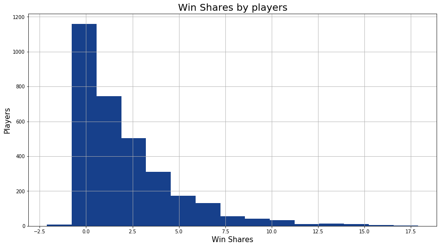

# NBA Performance

How do we measure which player is better than the next? Or better question is how do we measure the overall success a player brings to their team? This will determine which player will eventually win the most valuable player award at the end of the season or make it to the All-Star team?

According to Basketball-Reference, win shares is a metric that estimates the number of wins a player produces for his team throughout the season. We believe win shares is a very good indicator but how do we predict win shares and what is it based on - Personal Success? Or Basic stats like number of points you score, assist or rebound? Or Advances Stats like how well you contribute to the team? Or rather a combination of Basic and Advanced metrics?

What criteria matters most in making your MVP decision? Answers by some of NBA sports writers/analyst?
  - Steve Aschburner: The MVP is the best player on the team with the best record.
  - Fran Blinebury: Consistent individual excellence combined with team leadership and more than a few moments of transcendent brilliance.
  - John Schuhmann: My vote went to the individual who had the biggest effect on why a good team was good.
   - Sekou Smith: I've said all along that there's a complicated matrix of factors that go into making this vote.
   - Ian Thomsen: I love this award because it’s all about value: who has done the most for his team?
  - Lang Whitaker: I'm doing my best to keep it simple: Value.

Source: https://www.nba.com/article/2017/04/12/blogtable-what-criteria-matters-most-making-mvp-decision


### Data Sources:

Web Scrape data for Win Shares
* Scrape data for 2015-2019 seasons and 2019-2020 season: www.basketball-reference.com
  * Scrape historical data first using "Scraping Historical NBA Data.ipynb" jupyter notebook
  * Latest data for 2020 season is scraped in the other jupyter notebook with the machine learning predictions

Data for NBA Fantasy
* Download data from Rotoguru website: www.rotoguru.net

## Technologies used:
```
Scikit Learn
Pandas
Matplotlib
Seaborn - Install in Python environment using "pip install seaborn"
Plotly - Install in Python environment using "pip install plotly==4.5.0"

```

# Win Shares

#### Data Collection:
  * Web Scrape from Basketball Reference (www.basketball-reference.com)
    * 2015-2019 Seasons
      * Basic Stats
      * Advanced Stats
      * Merge them into one and save as CSV
      
      
      
    * 2019-2020 Season
      * Basic Stats
      * Advanced Stats
      * Merge them into one
      * Ran up to date data for current season 
    * Beautiful Soup was used to scrape the data. The links for basic stats and advanced stats are different. The code below shows how the links are being called to scrape for each year:
    ```
    adv_url = "https://www.basketball-reference.com/leagues/NBA_{}_advanced.html".format(year)
    adv_html = urlopen(adv_url)
    soup_av = BeautifulSoup(adv_html)
    
    pg_url = "https://www.basketball-reference.com/leagues/NBA_{}_per_game.html".format(year)
    pg_html = urlopen(pg_url)
    soup_pg = BeautifulSoup(pg_html)
    ```
     

#### Feature Selection:

  * Find the most important feature(s) to be used for the model
    * Random Forest Regression
    * Correlation Matrix (Pearson R-Square Correlation)
      * Create a Heatmap

#### Supervised Machine Learning Model
  * Training and Validation using scikit learn module
    * Train –
      * Year 2015-2019
      * Multi-Linear Regression
    * Validate/Test –
      * Year 2019-2020 (Current Season)
      * Check our predicted win shares values against the actual
  * Prediction All-Star Players
    * Players with top 10 win shares are predicted All-Star players
    * Compare the prediction All-Star Players and actual All-Star Players that played on 2/16/2020


# NBA Fantasy
#### Data Collection:
    * 2019-2020 Seasons
    
#### Supervised Machine Learning Model
  * Training and Testing using scikit learn module
    * ElasticNet module
    * Check Fan Duel Predictions(FDP) values against the actual
    * Compare the prediction of FDP predictions and actual FDP that players played on First______ 


#### Challenges/Limitations:
  * Using more historical data to train was a challenge 
  * The actual All-Star players may be selected based on some emotional bias than the statistics

  
#### Next Steps:
  * Creating and launching a webapp to visualize predictions would be helpful for end users to use the insights
  
    
#### Contributors:
  * Sai
  * Dan
  * Deepen
  * Pratikchhya
  * Pavana Srinivasa
